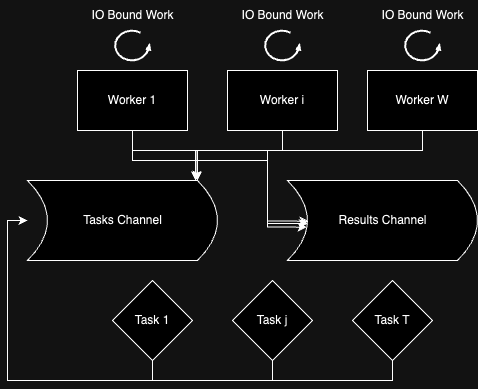

# Go Concurrency Patterns


## A note on IO-bound vs CPU-bound workloads

Time improvements are only visibile in IO-bound operations when running concurrent programming across the same CPU:

In threaded CPU-bound operations running on a single CPU, threads will switch in and out of CPU time. Since no gain is done from waiting when a thread is not running in CPU (unlike IO-bound operations), no real improvements to the overall time are gained from switching between sevaral threads.

On the other hand, IO-bound operations running on a single CPU will gain time when switching out of the CPU as the time taken by the waiting can be done outside of the CPU (e.g network call etc.). 

Goroutines can run on different CPUs but this is not guaranteed.

## Pool

Given W workers adn T tasks, the *Pool* pattern allows for running a limited amount of simultaneous operations. This pattern is valuable when you have a large number of tasks to execute.


Suppose you only have a limited number of threads on your machine. The Pool pattern allows for you to run any number of tasks without spawning more than the number of threads running on your machine.

As shown in the following diagram, the tasks are queued up in the `Tasks Channel`, picked up by a free `Worker` and the results of each `IO Bound Work` is published to the `Results Channel`.



Both the `Tasks Channel` and `Results Channel` have a capacity of T (# of tasks).

A worker only completes when there are no more tasks in `Tasks Channel` to be processed.
Workers get allocated tasks to run concurrently.


### Pseudo-code in Go

1. Initialise channels.
2. Create workers.
3. Enqueue tasks.
4. Wait for all tasks to be proceeded.

```go

import "sync"

func pool() {

	// create channels
	tasks := make(chan int, T)
	results := make(chan int, T)

	// create workers with waiting group to prevent ending func without workers completing
	var wg sync.WaitGroup
	for worker := range workers {
		wg.Add(1)
		go func() {
			defer wg.Done()
			// do work
		}()
	}

	// enqueue tasks
	for t := range ts {
		tasks <= t
	}
	close(tasks)

	// wait for workers to finish
	go func() {
		wg.Wait()
		close(results)
	}
}

```

